# fTornado

**Privacy-preserving token wrapper combining Tornado Cash anonymity pools with Zama's FHE-based confidential tokens (ERC7984)**

---

## The Problem

Zama's Fully Homomorphic Encryption (FHE) contracts enable computation on encrypted data. With ERC7984 confidential tokens, user balances are encrypted on-chain—only a handle is stored, and decryption requires explicit permission grants. Even during transfers, amounts remain encrypted.

However, **on-chain metadata still leaks information**. Transaction patterns, contract interactions, and address relationships can be analyzed to link your confidential token activity back to your identity.

## The Solution

fTornado breaks the on-chain link between your original funds and your confidential tokens by combining two privacy technologies:

1. **Tornado Cash-style commitment pools** — severs the transaction graph at deposit/withdrawal
2. **ERC7984 confidential tokens** — encrypts balances and transfer amounts

---

## How It Works

Each fTornado contract wraps a specific ERC20 token (e.g., USDC) at fixed denominations.

### Wrapping Flow (ERC20 → Confidential Token)

```
1. DEPOSIT: Send 100 USDC + commitment(secret, nullifier) to the pool
2. WAIT: Allow other deposits to accumulate (anonymity set grows)
3. WRAP: Submit ZK proof that you know the secret/nullifier for a commitment
   → Pool verifies proof, stores nullifierHash (prevents double-spend)
   → Receive 100 ftUSDC (ERC7984 confidential token)
```

### Unwrapping Flow (Confidential Token → ERC20)

```
1. BURN: Destroy 100 ftUSDC + new commitment(secret, nullifier)
2. WAIT: Allow other burns to accumulate
3. WITHDRAW: Submit ZK proof for your commitment
   → Receive 100 USDC to any address
```

### Direct Deposit/Withdraw (Classic Mixer Mode)

Users can bypass the confidential token layer entirely and use fTornado as a standard Tornado Cash-style mixer:

```
1. DEPOSIT: Send 100 USDC + commitment(secret, nullifier) to the pool
2. WAIT: Allow other deposits to accumulate
3. WITHDRAW: Submit ZK proof directly (skip wrapping)
   → Receive 100 USDC to any address
```

This flexibility means deposits from direct withdrawers and wrappers share the same anonymity set, strengthening privacy for everyone.

---

## Why This Matters

### Multiple Privacy Layers

Unlike standard Tornado Cash (which only breaks links during deposit/withdraw), fTornado adds an intermediate confidential token layer:

| Standard Tornado | fTornado |
|------------------|----------|
| Deposit → Wait → Withdraw | Deposit → Wait → **Wrap → Use privately → Burn** → Wait → Withdraw |
| | *or* Deposit → Wait → Withdraw (classic mode) |

### Flexible Usage Modes

Users can choose their privacy model:

- **Full cycle**: Deposit → Wrap → Transfer/Use → Burn → Withdraw (maximum privacy)
- **Tornado-only**: Deposit → Withdraw directly (skip wrapping, classic mixer behavior)
- **Confidential-only**: Wrap existing pool deposits, hold/transfer ftTokens indefinitely

### Compounding Anonymity

Every user action (deposit, wrap, transfer, burn, withdraw) adds to the overall anonymity set. The confidential token layer means even *usage* of funds doesn't leak information—unlike withdrawing from Tornado Cash, where spending patterns can be traced.

The shared pool between direct withdrawers and wrappers creates a larger, more robust anonymity set than either approach alone.

---

## Architecture

```mermaid
flowchart TB
    subgraph pool[" "]
        direction TB
        
        erc20_in["💵 ERC20 (USDC)"]
        
        deposit["📥 Deposit Pool<br/><i>commitment = hash(secret, nullifier)</i>"]
        
        wrap["🔐 Wrap<br/><i>mint ftToken</i>"]
        
        ft["🛡️ ftUSDC (ERC7984)<br/>━━━━━━━━━━━━━━<br/>• Encrypted balances<br/>• Private transfers<br/>• FHE computation"]
        
        burn["🔥 Burn<br/><i>new commitment</i>"]
        
        withdraw["📤 Withdraw<br/><i>to any address</i>"]
        
        erc20_out["💵 ERC20 (USDC)"]
        
        erc20_in --> deposit
        deposit -->|"ZK Proof"| wrap
        deposit -.->|"ZK Proof<br/>(direct mode)"| withdraw
        wrap --> ft
        ft --> burn
        burn -->|"ZK Proof"| withdraw
        withdraw --> erc20_out
    end
    
    style erc20_in fill:#f0fdf4,stroke:#22c55e,stroke-width:2px,color:#166534
    style deposit fill:#eff6ff,stroke:#3b82f6,stroke-width:2px,color:#1e40af
    style wrap fill:#faf5ff,stroke:#a855f7,stroke-width:2px,color:#6b21a8
    style ft fill:#fefce8,stroke:#eab308,stroke-width:2px,color:#854d0e
    style burn fill:#fff7ed,stroke:#f97316,stroke-width:2px,color:#9a3412
    style withdraw fill:#fdf4ff,stroke:#d946ef,stroke-width:2px,color:#86198f
    style erc20_out fill:#f0fdf4,stroke:#22c55e,stroke-width:2px,color:#166534
    style pool fill:#fafafa,stroke:#e5e5e5,stroke-width:2px
```


---

## Key Features

- **Fixed denominations** — Ensures uniformity in the anonymity set
- **Commitment scheme** — `commitment = hash(secret, nullifier)`
- **Nullifier tracking** — Prevents double-spending across wrap and withdraw operations
- **ZK proofs** — Prove knowledge without revealing which commitment is yours
- **ERC7984 compliance** — Full compatibility with Zama's confidential token standard
- **Unified anonymity pool** — Direct withdrawers and wrappers share the same set

---

## Comparison

| Feature | Tornado Cash | ERC7984 Alone | fTornado |
|---------|--------------|---------------|----------|
| Breaks deposit/withdraw link | ✓ | ✗ | ✓ |
| Encrypted balances | ✗ | ✓ | ✓ |
| Private transfers | ✗ | ✓ | ✓ |
| Usage doesn't leak info | ✗ | ✓ | ✓ |
| Multiple anonymity layers | ✗ | ✗ | ✓ |
| Flexible privacy modes | ✗ | ✗ | ✓ |

---

### Prerequisites

Before running this project, ensure you have the following tools installed:

#### 1. Node.js and npm

This project requires **Node.js v18+** and **npm**.

```bash
# Check if Node.js is installed
node --version

# If not, install from https://nodejs.org/ or use nvm:
nvm install 18
nvm use 18
```

#### 2. Circom (Circom Compiler)

Circom is required for compiling zero-knowledge circuits.

```bash
# Check if circom is installed
circom --version

# Build from source 
git clone https://github.com/iden3/circom.git
cd circom
cargo build --release
cargo install --path circom
```

#### 3. Hardhat

Hardhat is used for smart contract development, testing, and deployment.

```bash
# Install Hardhat globally (optional, can use npx)
npm install -g hardhat

# Or use via npx (included in this project's dependencies)
npx hardhat --version
```

#### 4. Python (Optional)

Required for some FHE operations and Zama tooling.

```bash
# Check Python installation
python3 --version

# Install Python 3.8+ if needed
# macOS: brew install python3
# Ubuntu: sudo apt install python3
```

#### 5. SnarkJS

Used for generating and verifying zero-knowledge proofs.

```bash
# Install globally
npm install -g snarkjs
```

## Commands

### Installation

Install all project dependencies:
```bash
npm install
```

### Circuit Development

Compile the zero-knowledge circuits and generate the verifier contract:
```bash
npm run circuits:compile
```

Run circuit tests to verify correctness:
```bash
npm run circuits:test
```

### Smart Contract Development

Compile Solidity contracts:
```bash
npm run contracts:compile
```

Run contract test suite:
```bash
npm run contracts:test
```

### Full Workflow

For a complete development cycle (circuits → contracts → tests):
```bash
npm install                # Install dependencies
npm run circuits:compile   # Build ZK circuits
npm run circuits:test      # Verify circuits
npm run contracts:compile  # Build contracts
npm run contracts:test     # Run integration tests
```

### Support

- **GitHub Issues**: [Report bugs or request features](https://github.com/zama-ai/fhevm/issues)
- **Documentation**: [FHEVM Docs](https://docs.zama.ai)
- **Community**: [Zama Discord](https://discord.gg/zama)